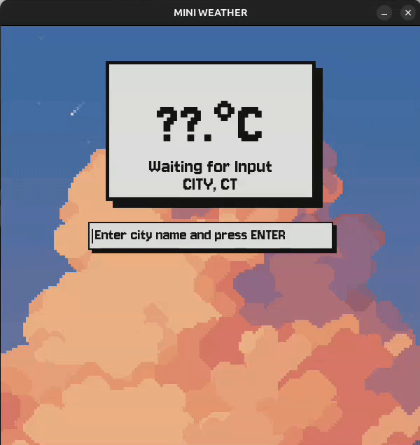

# mini-weather: minimalist pixel-art weather client

[](https://opensource.org/licenses/MIT)
[](https://www.python.org/downloads/)

## 🌟 Project Overview

**Mini-weather is a minimalist weather application built with Python, designed to fetch and display current weather data for any specified location with a pixel-art aesthetic.**

## 🕹️ Project Showcase 



## ✨ Features

* **Pixel UI:** The pixel-art interface provides a cozy user experience.
* **Data Fetching:** Utilizes the **OpenWeatherMap API** to fetch weather data.
* **Key Info:** Focuses on core data points: **current temperature**, **weather description**, and **location**.
* **Python Native:** Built using standard Python libraries, making it highly portable and easy to run.

---

## 🚀 Installation & Setup

### Requirements

* Python 3.6 or higher.
* The packages listed in `requirements.txt`.

### Installation Steps

1.  **Clone the Repository:**
    ```bash
    git clone https://github.com/toria31/mini-weather.git
    cd mini-weather
    ```

2.  **Set up Virtual Environment (Recommended):**
    ```bash
    python3 -m venv venv
    source venv/bin/activate  # On Windows use: venv\Scripts\activate
    ```

3.  **Install Dependencies:**
    ```bash
    pip install -r requirements.txt
    ```
---

## 💡 Usage

### First-Run Setup

The application requires an OpenWeatherMap API key to function. **This step only occurs the first time you run the application.**
1.  **Obtain Your Key:** Sign in or create [OpenWeatherMap](https://home.openweathermap.org/users/sign_in) account, then find and copy your personal [API key](https://home.openweathermap.org/api_keys).
2.  **Launch App:** Run the main Python script from your terminal:
    ```bash
    python3 main.py
    ```
3.  **Enter API Key:** When the app displays the **"ENTER API KEY"** screen, **enter your API key** into the input box and press **[ENTER]**.
    * The application will save this key locally in a file named `data.txt` so you only need to enter it once.

### Standard Use

After the first successful run, the app will automatically load your saved key and launch the weather display:

```bash
python3 main.py
```

## 🛠️ Built With
* **Python:** The core application language.
* **Requests:** Used for handling HTTP API calls to OpenWeatherMap.
* **Pygame:** Used for rendering the pixel-art graphics, window management, and handling user input.
* **Pyperclip:** Used for handling clipboard interactions.

## 📜 License
Distributed under the MIT License. See the [LICENSE](LICENSE) file for more information.
